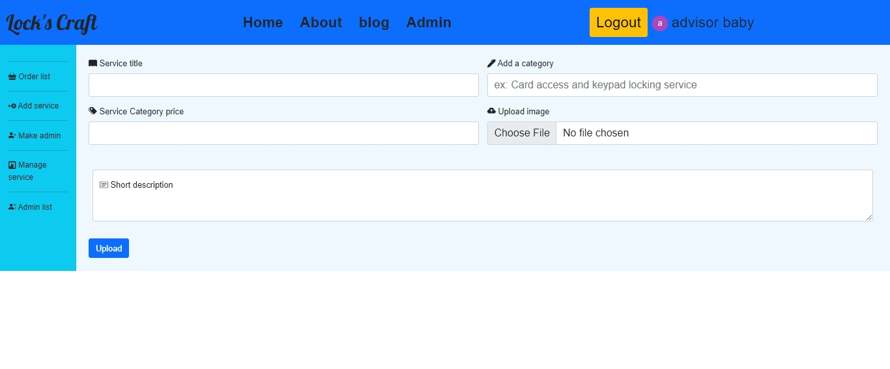
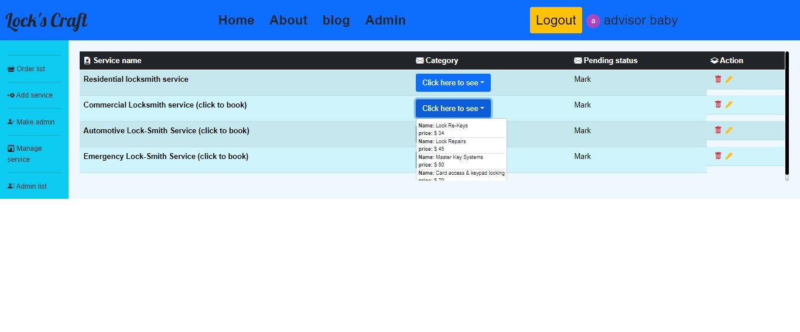
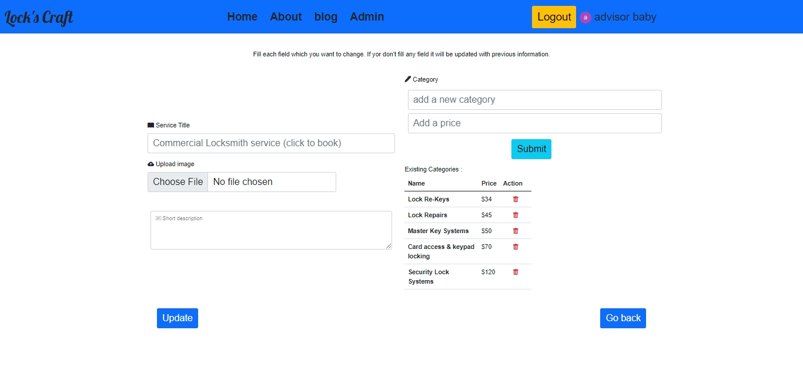
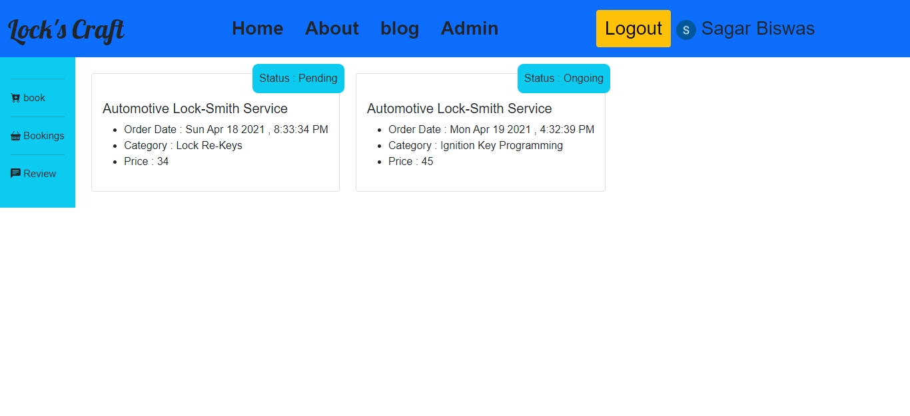
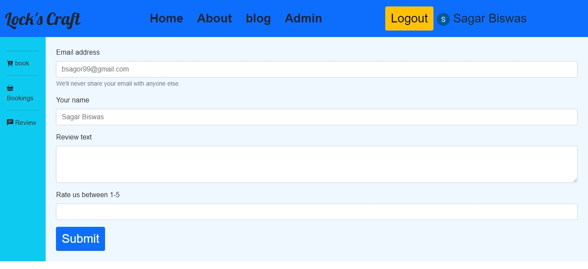
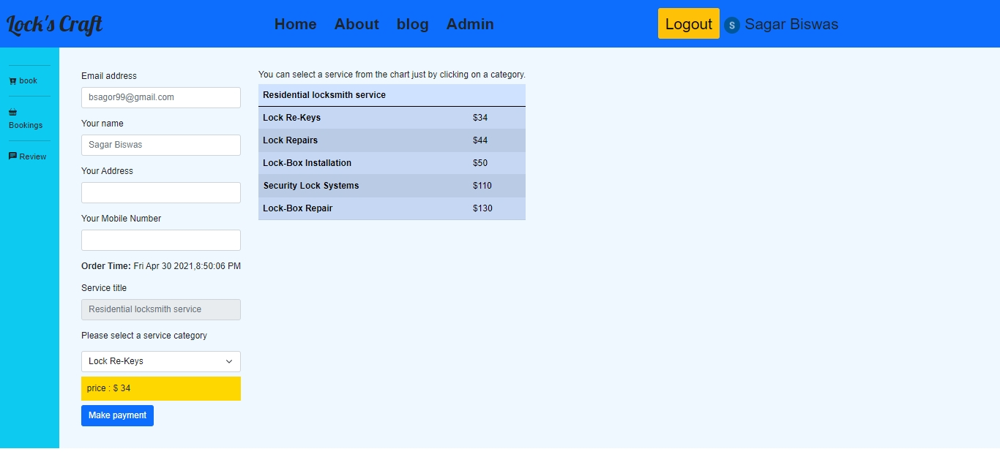

Live Site URL [Click here](https://locks-draft.netlify.app/).

## Project name - Locks-craft

This is **MERN** fullstack project.  

> ### Features
>> User can book a service.  
>> S/he needs to login/signin before accessing protected pages.(Currently google signIn option available only.)  
>> User can see his booking record in order page.  
>> In the admin panel , admin can do **CRUD** operation.   
>> There is also order tracking option .  
>> Admin can add an email for admin role, at the same time admin can remove admin role for an email.  
>> In admin panel there is a manage order page from which admin can update status of an order.  
>> User can give review.  
>> In this project a used Ghost Cms Api for fetching post that are published in my Personal Ghost CMS for experimental purpose.  
>> Stripe payment method is integrated. Users can use a fake credit card number to book a order.  

Server Side code [Click here](https://github.com/sagar-biswas1/locks-craft-server)  

some screen-shots : 

[Service add page]  
[Manage service page]  
[Manage service page]  
[User's order page page] 
[Give review page]  
[Booking page]     

